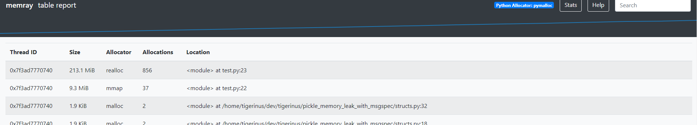

# Pickler Memory Leak Test

This test shows a potential memory leak in Pickler when dumping a [Struct](https://jcristharif.com/msgspec/structs.html) class from the [msgspec](https://jcristharif.com/msgspec/) project.

```bash
$ pip install -r requirements.txt
...

$ memray run -o memray_trace.bin test.py 
...

$ memray stats memray_trace.bin 
📏 Total allocations:
        934

📦 Total memory allocated:
        222.345MB

📊 Histogram of allocation size:
        min: 32.000B
        -----------------------------------------
        < 154.000B :  1 ▇▇▇
        < 748.000B : 12 ▇▇▇▇▇▇▇▇▇▇▇▇▇▇▇▇▇▇▇▇▇▇▇▇▇
        < 3.531KB  :  9 ▇▇▇▇▇▇▇▇▇▇▇▇▇▇▇▇▇▇▇
        < 17.077KB :  1 ▇▇▇
        < 82.570KB :  0 
        < 399.229KB:  0 
        < 1.885MB  :  0 
        < 9.114MB  :  0 
        < 44.066MB :  1 ▇▇▇
        <=213.061MB:  1 ▇▇▇
        -----------------------------------------
        max: 213.061MB

📂 Allocator type distribution:
         MALLOC: 23
         MMAP: 1
         REALLOC: 1

🥇 Top 5 largest allocating locations (by size):
        - <module>:test.py:23 -> 213.061MB
        - <module>:test.py:22 -> 9.250MB
        - _call_with_frames_removed:<frozen importlib._bootstrap>:228 -> 16.221KB
        - <module>:/home/tigerinus/dev/tigerinus/pickle_memory_leak_with_msgspec/structs.py:32 -> 1.906KB
        - <module>:/home/tigerinus/dev/tigerinus/pickle_memory_leak_with_msgspec/structs.py:18 -> 1.867KB

🥇 Top 5 largest allocating locations (by number of allocations):
        - <module>:test.py:23 -> 856
        - <module>:test.py:22 -> 37
        - _call_with_frames_removed:<frozen importlib._bootstrap>:228 -> 15
        - <module>:/home/tigerinus/dev/tigerinus/pickle_memory_leak_with_msgspec/structs.py:32 -> 2
        - <module>:/home/tigerinus/dev/tigerinus/pickle_memory_leak_with_msgspec/structs.py:18 -> 2

memray table memray_trace.bin -o memray_trace.html

open memray_trace.html
```

## screenshot of captured memory leak


